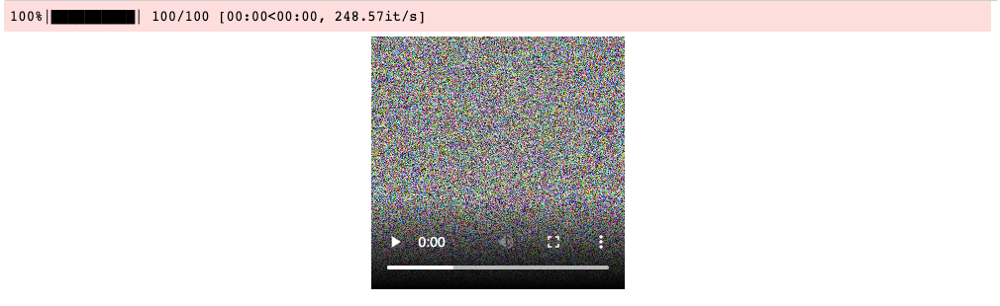

# Video from numpy array in Jupyter Notebook
[](https://badge.fury.io/py/notebook-video-writer)   
  
Create videos from numpy arrays in a jupyter notebook  

Packaged version of [Alexander Mordvintsev's Colab Snippets](https://github.com/znah/notebooks/blob/master/external_colab_snippets.ipynb)

### Install    
  
`pip install notebook-video-writer`  

### Dependencies  
  - Must have ffmpeg installed  

### Usage  
```python

import numpy as np
# optionally wrap with tqdm for progress bar
from tqdm import tqdm
from notebook_video_writer import VideoWriter

with VideoWriter(fps=40) as vw:
    for i in tqdm(range(100)):
        frame = np.random.rand(256,256,3)
        vw.add(frame)

```    
This will immediately display the video inline below the cell:  
  
   
  
An mp4 file is also saved to the current directory. Default name is `_autoplay.mp4`, but can be set with `name` keyword arg.
